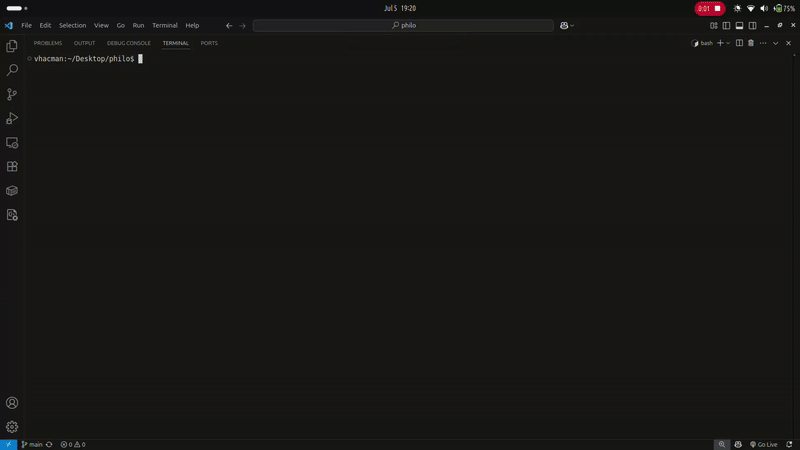

<h1>PHILOSOPERS</h1>

[](https://github.com/vhacman/philo)  
[](https://en.wikipedia.org/wiki/C_(programming_language))  
[](https://github.com/42School/norminette)  
[](https://valgrind.org/)

<h1>Dining Philosophers Problem 🍝</h1>
Problema di sincronizzazione concorrente introdotto da Dijkstra. Cinque filosofi siedono attorno a un tavolo rotondo, ognuno con un piatto di spaghetti e una forchetta tra ogni coppia di piatti. Per mangiare servono due forchette: quella a sinistra e quella a destra. I filosofi alternano due stati: pensare e mangiare.

<h2>Vincoli principali🔒</h2>
Un filosofo può mangiare solo se ha entrambe le forchette.
Le forchette sono condivise con i vicini.
Nessun filosofo sa in anticipo cosa faranno gli altri.
<h2>Problemi:⚠️</h2>
- **Deadlock:** tutti bloccati ad aspettare.
- **Starvation:** uno o più filosofi non riescono mai a mangiare.
- **Livelock:** tutti cambiano stato continuamente senza avanzare.

<h2>La sfida:</h2>
- Evitare **deadlock**
- Prevenire **race conditions**
- Garantire che nessuno **muoia di fame**
- Assicurare una terminazione ordinata della simulazione

<h2> FUNZIONI CONSENTITE </h2>
<p> Il progetto utilizza **esclusivamente** le seguenti funzioni, nel rispetto rigoroso dei vincoli imposti dalla scuola 42. </p>

| Funzione         | Utilizzo nel progetto                                                                 |
|------------------|----------------------------------------------------------------------------------------|
| `memset`         | Inizializza aree di memoria a zero (es. strutture e array)                            |
| `printf`         | Stampa formattata (usata solo per errori o debugging eventuale, **non** nella routine)|
| `malloc`         | Allocazione dinamica della memoria per filosofi, mutex e strutture condivise          |
| `free`           | Deallocazione ordinata della memoria allocata                                         |
| `write`          | Stampa sincronizzata dei messaggi della simulazione (es. "is eating", "died", ecc.)   |
| `usleep`         | Attesa in microsecondi (simula `time_to_eat` e `time_to_sleep`)                       |
| `gettimeofday`   | Misura il tempo corrente in millisecondi per monitorare fame e morte                  |

---

| Funzione               | Utilizzo nel progetto                                                                 |
|------------------------|----------------------------------------------------------------------------------------|
| `pthread_create`       | Crea un nuovo thread per ogni filosofo e per il monitor                              |
| `pthread_detach`       | Rende il thread indipendente dal processo principale (non richiede `join`)           |
| `pthread_join`         | Attende la terminazione di un thread specifico (usato solo nei casi richiesti)       |
| `pthread_mutex_init`   | Inizializza i mutex associati alle forchette e alla stampa                           |
| `pthread_mutex_destroy`| Libera le risorse occupate dal mutex                                                 |
| `pthread_mutex_lock`   | Acquisisce un mutex (usato per prendere forchette o accedere a dati condivisi)       |
| `pthread_mutex_unlock` | Rilascia un mutex precedentemente acquisito                                          |

---
<h2> 🔧 Compilazione </h2>

È fornito un Makefile con le seguenti regole:

```bash
make        # compila il programma
make clean  # rimuove i file oggetto
make fclean # rimuove l'eseguibile e i file oggetto
make re     # fclean + make
```
<h2>UTILIZZO</h2>

```bash
./philo number_of_philosophers time_to_die time_to_eat time_to_sleep [meals_required]
```

| Nome parametro               | Tipo | Descrizione                                                     |
| ---------------------------- | ---- | --------------------------------------------------------------- |
| `number_of_philosophers`     | int  | Numero di filosofi attorno al tavolo                            |
| `time_to_die`                | int  | Tempo massimo (in millisecondi) senza mangiare prima di morire  |
| `time_to_eat`                | int  | Tempo impiegato per mangiare (in millisecondi)                  |
| `time_to_sleep`              | int  | Tempo dedicato al sonno dopo il pasto (in millisecondi)         |
| `meals_required` (opzionale) | int  | Numero di pasti da consumare prima di concludere la simulazione |

Esempio
```bash
./philo 5 800 200 200
```
Crea 5 filosofi con 800ms di tolleranza prima della morte, 200ms per mangiare, 200ms per dormire.

```bash
./philo 5 800 200 200 3
```
Simulazione che termina solo dopo che ciascun filosofo ha mangiato almeno 3 volte.

<h2> 🧬 Struttura interna </h2>
<h3>Thread principali</h3>
- Un thread per filosofo: ogni filosofo esegue in concorrenza la sua routine (pensare → prendere forchette → mangiare → dormire)
- Un thread di monitoraggio: osserva costantemente il tempo trascorso dall'ultimo pasto di ogni filosofo, determinando morte o terminazione

<h2> Sincronizzazione </h2>
- pthread_mutex_t per ogni forchetta
- Mutex globale per la stampa (evita output corrotti)
- Mutex per dati critici come last_meal_time e meals_eaten

<h2> FILE PRINCIPALI </h2>

| File                       | Ruolo principale                                            |
| -------------------------- | ----------------------------------------------------------- |
| `main.c`                   | Punto d’ingresso. Inizializza, avvia e termina il programma |
| `philo.h`                  | Definizione delle strutture, macro e prototipi              |
| `initialization.c`         | Costruzione delle strutture dati iniziali                   |
| `init_mutexes_and_forks.c` | Inizializzazione dei mutex (forchette e controllo globale)  |
| `parse_args.c`             | Validazione e parsing degli argomenti                       |
| `parse_utils.c`            | Conversioni sicure e gestione errori numerici               |
| `routine.c`                | Ciclo di vita di ciascun filosofo                           |
| `routine_utils.c`          | Operazioni ausiliarie legate al comportamento del filosofo  |
| `monitor.c`                | Thread supervisore: rileva morte e completamento pasti      |
| `monitor_utils.c`          | Funzioni di supporto al monitor                             |
| `thread_utils.c`           | Creazione, gestione e join dei thread                       |
| `death_utils.c`            | Registrazione e notifica della morte                        |
| `fork_utils.c`             | Gestione atomica della presa e rilascio delle forchette     |
| `print_utils.c`            | Output sincronizzato per azioni dei filosofi                |
| `time_utils.c`             | Temporizzazione precisa (`get_time`, `custom_usleep`)       |
| `libft_utils.c`            | Implementazioni custom per evitare funzioni vietate         |
| `clean.c`                  | Deallocazione ordinata di risorse e mutex                   |

---

PHILOSOPHERS
Show Image
Show Image
Show Image
Show Image
Dining Philosophers Problem 🍝
Problema di sincronizzazione concorrente introdotto da Dijkstra. Cinque filosofi siedono attorno a un tavolo rotondo, ognuno con un piatto di spaghetti e una forchetta tra ogni coppia di piatti. Per mangiare servono due forchette: quella a sinistra e quella a destra. I filosofi alternano due stati: pensare e mangiare.
Vincoli principali🔒
Un filosofo può mangiare solo se ha entrambe le forchette.
Le forchette sono condivise con i vicini.
Nessun filosofo sa in anticipo cosa faranno gli altri.
Problemi:⚠️

Deadlock: tutti bloccati ad aspettare.
Starvation: uno o più filosofi non riescono mai a mangiare.
Livelock: tutti cambiano stato continuamente senza avanzare.

La sfida:

Evitare deadlock
Prevenire race conditions
Garantire che nessuno muoia di fame
Assicurare una terminazione ordinata della simulazione

FUNZIONI CONSENTITE
Il progetto utilizza esclusivamente le seguenti funzioni, nel rispetto rigoroso dei vincoli imposti dalla scuola 42.
FunzioneUtilizzo nel progettomemsetInizializza aree di memoria a zero (es. strutture e array)printfStampa formattata (usata solo per errori o debugging eventuale, non nella routine)mallocAllocazione dinamica della memoria per filosofi, mutex e strutture condivisefreeDeallocazione ordinata della memoria allocatawriteStampa sincronizzata dei messaggi della simulazione (es. "is eating", "died", ecc.)usleepAttesa in microsecondi (simula time_to_eat e time_to_sleep)gettimeofdayMisura il tempo corrente in millisecondi per monitorare fame e morte

FunzioneUtilizzo nel progettopthread_createCrea un nuovo thread per ogni filosofo e per il monitorpthread_detachRende il thread indipendente dal processo principale (non richiede join)pthread_joinAttende la terminazione di un thread specifico (usato solo nei casi richiesti)pthread_mutex_initInizializza i mutex associati alle forchette e alla stampapthread_mutex_destroyLibera le risorse occupate dal mutexpthread_mutex_lockAcquisisce un mutex (usato per prendere forchette o accedere a dati condivisi)pthread_mutex_unlockRilascia un mutex precedentemente acquisito

🔧 Compilazione
È fornito un Makefile con le seguenti regole:
bashmake        # compila il programma
make clean  # rimuove i file oggetto
make fclean # rimuove l'eseguibile e i file oggetto
make re     # fclean + make
UTILIZZO
bash./philo number_of_philosophers time_to_die time_to_eat time_to_sleep [meals_required]
Nome parametroTipoDescrizionenumber_of_philosophersintNumero di filosofi attorno al tavolotime_to_dieintTempo massimo (in millisecondi) senza mangiare prima di moriretime_to_eatintTempo impiegato per mangiare (in millisecondi)time_to_sleepintTempo dedicato al sonno dopo il pasto (in millisecondi)meals_required (opzionale)intNumero di pasti da consumare prima di concludere la simulazione
Esempio
bash./philo 5 800 200 200
Crea 5 filosofi con 800ms di tolleranza prima della morte, 200ms per mangiare, 200ms per dormire.
bash./philo 5 800 200 200 3
Simulazione che termina solo dopo che ciascun filosofo ha mangiato almeno 3 volte.
🧬 Struttura interna
Thread principali

Un thread per filosofo: ogni filosofo esegue in concorrenza la sua routine (pensare → prendere forchette → mangiare → dormire)
Un thread di monitoraggio: osserva costantemente il tempo trascorso dall'ultimo pasto di ogni filosofo, determinando morte o terminazione

Sincronizzazione

pthread_mutex_t per ogni forchetta
Mutex globale per la stampa (evita output corrotti)
Mutex per dati critici come last_meal_time e meals_eaten

FILE PRINCIPALI
FileRuolo principalemain.cPunto d'ingresso. Inizializza, avvia e termina il programmaphilo.hDefinizione delle strutture, macro e prototipiinitialization.cCostruzione delle strutture dati inizialiinit_mutexes_and_forks.cInizializzazione dei mutex (forchette e controllo globale)parse_args.cValidazione e parsing degli argomentiparse_utils.cConversioni sicure e gestione errori numericiroutine.cCiclo di vita di ciascun filosoforoutine_utils.cOperazioni ausiliarie legate al comportamento del filosofomonitor.cThread supervisore: rileva morte e completamento pastimonitor_utils.cFunzioni di supporto al monitorthread_utils.cCreazione, gestione e join dei threaddeath_utils.cRegistrazione e notifica della mortefork_utils.cGestione atomica della presa e rilascio delle forchetteprint_utils.cOutput sincronizzato per azioni dei filosofitime_utils.cTemporizzazione precisa (get_time, custom_usleep)libft_utils.cImplementazioni custom per evitare funzioni vietateclean.cDeallocazione ordinata di risorse e mutex

Contribuisci in modo rispettoso
Se trovi utile questo progetto, ti invito a non clonare direttamente la repository.
Fare una fork:

ti permette di avere una copia personale su cui lavorare liberamente;
rende trasparente il tuo interesse per il progetto;
mi aiuta a costruire un GitHub più professionale e tracciabile, mostrando quante persone hanno interagito realmente con il mio lavoro.
In questo modo posso far crescere il mio profilo e migliorare come sviluppatrice.

Come procedere

Clicca in alto a destra su Fork
Clona la tua copia con:

bashgit clone https://github.com/<il-tuo-username>/<nome-repo>.git

👤 Author
vhacman

42 Intra Profile: vhacman

Contatti 🧑‍💻
Show Image
Show Image
Show Image

<h2>  🎥 Video Demo </h2>

Guarda il progetto in azione!

- Compilazione del progetto
- Esempi di esecuzione con diversi parametri
- Comportamento della simulazione in tempo reale
- Gestione dei casi limite
  
<h3> Contribuisci in modo rispettoso </h3>

Se trovi utile questo progetto, ti invito a non clonare direttamente la repository.

Fare una **fork**:
- ti permette di avere una copia personale su cui lavorare liberamente;
- rende trasparente il tuo interesse per il progetto;
- mi aiuta a costruire un GitHub più professionale e tracciabile, mostrando quante persone hanno interagito realmente con il mio lavoro.
 In questo modo posso far crescere il mio profilo e migliorare come sviluppatrice.

<p>Come procedere</p>
1. Clicca in alto a destra su **Fork**

2. Clona la tua copia con:

```bash
git clone https://github.com/<il-tuo-username>/<nome-repo>.git

```
---

<h2> 👤 Author </h2>

**vhacman**
- 42 Intra Profile: [vhacman](https://profile.intra.42.fr/)

<h2> Contatti 🧑‍💻 </h2>

[](https://www.linkedin.com/in/viorica-gabriela-hacman-63a412267/)
[](https://www.facebook.com/profile.php?id=100090802467237)
[](https://www.instagram.com/vgabrielah_/)

